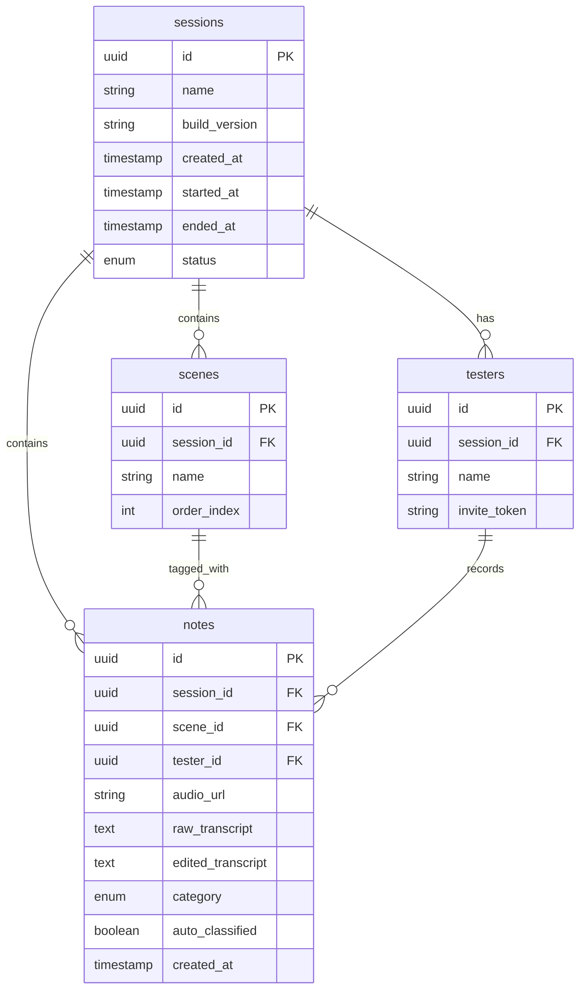
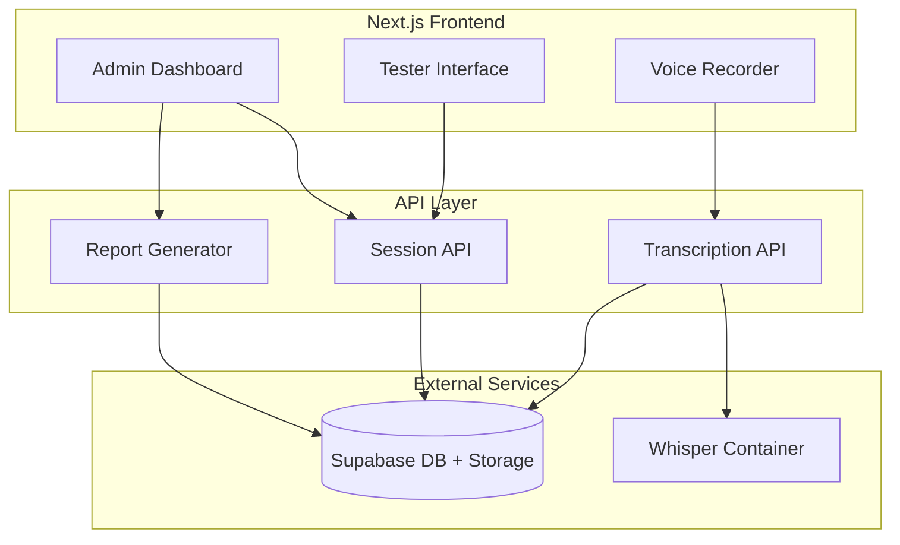

# Voice-Based Testing Notes Platform - Implementation Plan

## Overview

Build a Next.js web application based on the project specification, with an Extended MVP scope using Supabase for database/storage, simple invite-link authentication, and self-hosted Whisper for transcription.

---

## Step 1: Create Scoping Document

Create [`SCOPE.md`](SCOPE.md) documenting:

### Included in MVP

- **Session Management**: Create, start, end sessions with scenes
- **Voice Recording**: Record, pause, resume, stop with browser MediaRecorder API
- **Transcription**: Self-hosted Whisper integration via API
- **Editable Transcripts**: Edit transcribed text, retain raw + edited versions
- **Classification/Tagging**: Auto-classification (Bug, Feature, UX, Performance, Other)
- **Bias Prevention**: Testers cannot see others' feedback until session ends
- **Report Generation**: Summary, scene breakdown, PDF export
- **Simple Auth**: Invite-link based session access (no full user accounts)

### Deferred to Future

- Full user authentication (OAuth, accounts)
- Confluence/Jira/Linear integrations
- Cross-session trend analysis
- Spoken hotwords and bookmarks
- Mobile app (React Native)
- Anonymization features
- Duplicate detection
- Multi-project dashboards

---

## Step 2: Project Setup

```
echo_test/
├── src/
│   ├── app/                    # Next.js App Router
│   │   ├── (admin)/            # Admin routes
│   │   ├── (tester)/           # Tester routes
│   │   └── api/                # API routes
│   ├── components/             # React components
│   ├── lib/                    # Utilities, Supabase client
│   └── types/                  # TypeScript types
├── supabase/
│   └── migrations/             # Database migrations
├── whisper-service/            # Self-hosted Whisper API (Docker)
└── public/
```

---

## Step 3: Database Schema (Supabase)



---

## Step 4: Core Features Implementation

### 4.1 Admin Dashboard

- Create new sessions with name, build version, scenes
- View session list and status
- Start/end sessions
- Generate and download PDF reports

### 4.2 Tester Interface  

- Join via invite link with token
- Select current scene
- Voice recording controls (Record/Pause/Resume/Stop)
- View and edit own transcripts
- Optional category selection before recording

### 4.3 Whisper Integration

- Docker container running Whisper API (faster-whisper or whisper.cpp)
- API endpoint to receive audio blob, return transcription
- Confidence scoring for words

### 4.4 Report Generation

- Server-side PDF generation using `@react-pdf/renderer` or `puppeteer`
- Summary statistics, scene breakdowns, grouped feedback

---

## Technical Stack

| Layer | Technology |

|-------|------------|

| Framework | Next.js 14 (App Router) |

| Styling | Tailwind CSS + shadcn/ui |

| Database | Supabase (PostgreSQL) |

| Storage | Supabase Storage (audio files) |

| STT | Self-hosted Whisper (Docker) |

| PDF | @react-pdf/renderer |

| Deployment | Vercel (frontend) + Docker (Whisper) |

---

## Architecture Flow

